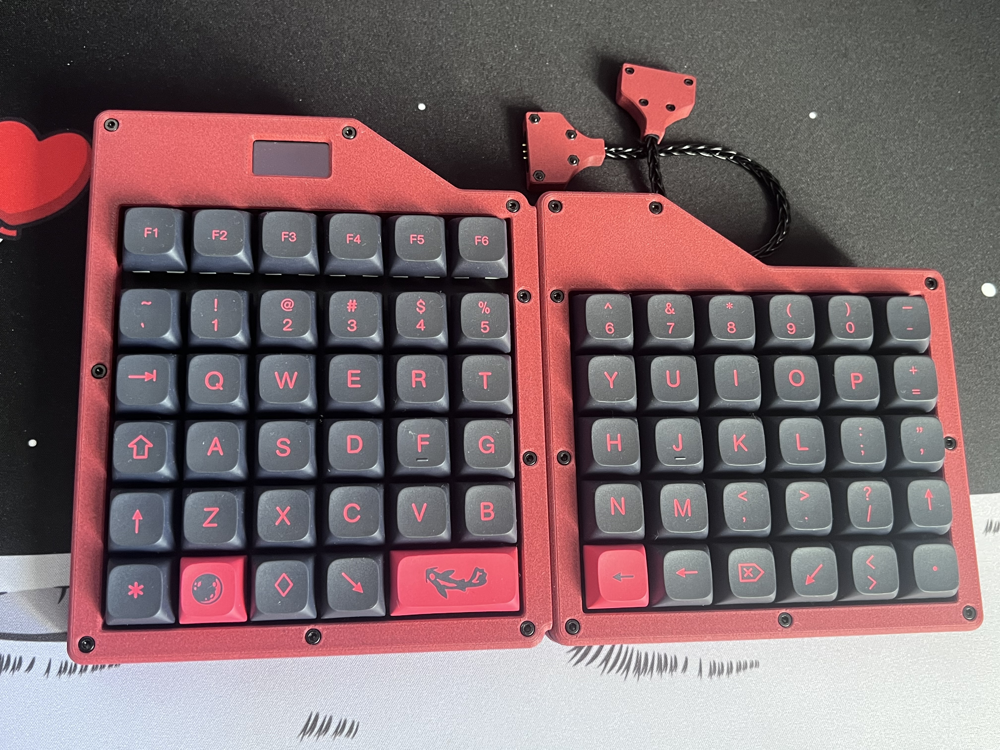
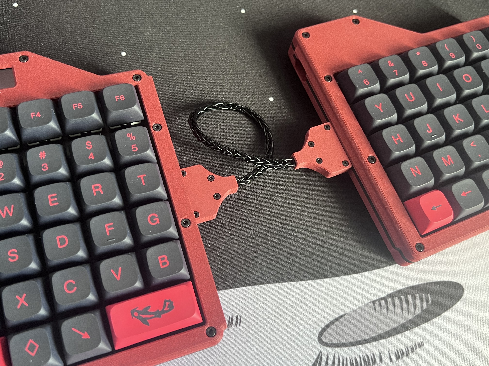

# pac_6Fs

pac_6Fs is an ortholinear 65-key keyboard designed primarily for gaming, adaptable for various usage scenarios through magnetic connectors. Key features include:

- **Macropad mode**: Use the left side only.
- **Single-piece keyboard**: For games requiring a compact, complete unit.
- **Split-typing mode**: Comfortable typing with a split layout.

---

## Images

---

## Case Files

Fusion 360 project files and separate STL files for keyboard pieces are included.

This is how I printed it:
- Material: Bambulab PLA-CF
- Layer Height: 0.15 mm
- Supports: Normal (only needed once for the left side upper case near OLED screen)

## Components & Supplies

- 3-pin magnetic connectors (with ears) x2 pairs [Link](https://www.aliexpress.com/item/1005006531774076.html)
- Pro Micro for Arduino ATmega32U4 x2 [Link](https://www.aliexpress.com/item/32846843498.html)
- Screws and Nuts:
  - M2.5×14 x18
  - M2×6 x8
  - M2 Nut x8 (all from [this set](https://www.aliexpress.com/item/1005007189779145.html). Also note, that the case was desined for screw heads exactly from this set)
  - M2×7 x2 (heads for this one should be small ehough to not colide with keycaps, as they are screwed into middle plates; no specific dimentions though)
- Inserts:
  - M2.5 (OD4mm), Length 5mm x18
  - M2 (OD3.5mm), Length 5mm x2 ([Link](https://www.aliexpress.com/item/1005003582355741.html))
- Neodymium Magnets:
  - 10×1mm Round x20 (bottom case and stand attachments)
  - 6×3mm Round x6 (halves attachments)
- 128x64 OLED Screen x1 [Link](https://www.aliexpress.com/item/1005004355547926.html)
- 1N4148 Diodes x65 [Link](https://www.aliexpress.com/item/4000142272546.html)
- 6x6x5mm Reset Button x2 [Link](https://www.aliexpress.com/item/32912263133.html)
- 10×2mm Silicone Cushion Mat x12 [Link](https://www.aliexpress.com/item/1005005315398342.html)
- 8 Core Single Crystal Copper Wire (approx. 20cm; Obv, you do not need all 8 threads, just solder 3 of them. I was looking for this type of wire because of its flexibility, which is kinda necessary, as the magnets I used are not so strong to keep stiff wire in place) [Link](https://www.aliexpress.com/item/1005006034458182.html)
- 65 Switches
- 64 1U Keycaps
- 1 2U Keycap

## Firmware & Wiring

**Firmware:** TBD  
**Wiring:** TBD  
Wiring approach based on [this video](https://youtu.be/hjml-K-pV4E).

## Notes & Recommendations

- **Internal Clearance:** The MCU area is quite tight; consider allowing more room.
- **Magnetic Connections:** The halves connection is loose; stronger magnets or redesign may be necessary. It barely enough to keep halves together on my keyboard stand, so I just kept it as is.
- **Printing Orientation:** Most parts can be printed in natural orientation, except the middle plates (should be printed upside down).
- **Left Middle Plate:** The cut-out for the 2U stabilizer did not work well. Consider omitting it or adjusting for different stabilizers.

---

## Disclaimer

This is my first self-designed project and nearly second experience with CAD. Some design decisions might not be optimal, but the project is fully functional. Feel free to modify and improve it!

